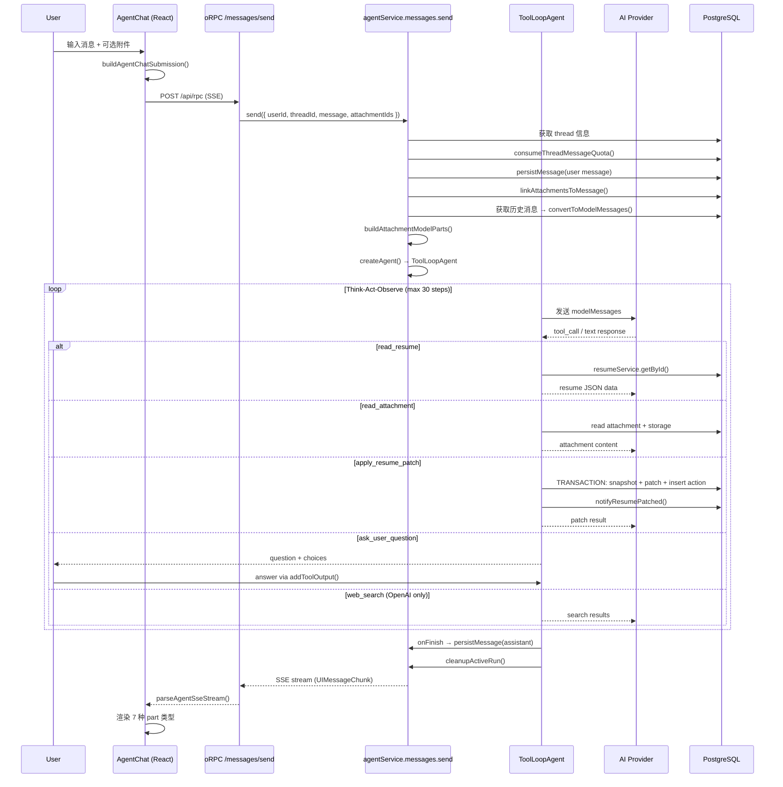

# Agent Chat 交互流程分析

## 概述

Reactive Resume 的 Agent Chat 是一个 AI 驱动的简历编辑助手。用户通过聊天界面与 LLM 交互，LLM 通过 **JSON Patch (RFC 6902)** 操作来分析和修改简历数据。系统使用 `ToolLoopAgent`（AI SDK v5）实现多步骤的"思考-行动-观察"循环，最多支持 30 步推理。

---

## 架构文件索引

| 层次 | 文件 | 职责 |
|------|------|------|
| 前端 UI | `apps/web/src/routes/agent/-components/agent-chat.tsx` | 聊天界面，SSE 解析，消息渲染 |
| 前端 Helper | `apps/web/src/routes/agent/-helpers/chat-attachments.ts` | 附件与消息载荷构建 |
| API 路由 | `packages/api/src/features/agent/messages.ts` | oRPC 端点（send/stop/resume） |
| 服务层 | `packages/api/src/features/agent/service.ts` | 核心编排：线程管理、消息发送、Patch 应用、回滚 |
| 工具定义 | `packages/api/src/features/agent/tools.ts` | Agent 5 个工具 + 系统指令 |
| 简历助手 | `packages/api/src/features/agent/resume.ts` | 草稿命名、Section 路径规范化 |
| JSON Patch | `packages/resume/src/patch.ts` | RFC 6902 操作校验与应用 |

---

## 交互流程总览



---

## 逐层分析

### 1. 前端层 (`agent-chat.tsx`)

#### 1.1 组件结构

`AgentChat` 是顶层容器组件，通过 `useChat` hook 管理整个聊天状态：

```ts
const { messages, sendMessage, regenerate, setMessages, status, error, clearError, addToolOutput } = useChat({
  id: threadId,
  messages: initialMessages,
  resume: !!activeRunId,
  transport,
  sendAutomaticallyWhen: lastAssistantMessageIsCompleteWithToolCalls,
  onFinish: () => { void refreshThread(); },
});
```

关键参数说明：
- **`resume: !!activeRunId`**：当线程有活跃运行中的 Agent 时，`useChat` 会自动重连 SSE 流，实现断线恢复
- **`sendAutomaticallyWhen`**：当 LLM 的最后一条消息包含完整的 tool call 时，自动将 tool output 发回后端，无需用户手动操作

#### 1.2 自定义 Transport

前端不直接使用默认的 HTTP transport，而是通过自定义 `transport` 对象调用 oRPC 流式端点：

```ts
const transport = useMemo(() => ({
  async sendMessages(options) {
    const message = options.messages.at(-1);
    const attachmentIds = attachmentIdsFromTransportBody(options.body);
    return parseAgentSseStream(
      eventIteratorToUnproxiedDataStream(
        await streamClient.agent.messages.send({ threadId, message, attachmentIds }, { signal: options.abortSignal })
      ),
    );
  },
  async reconnectToStream() {
    return parseAgentSseStream(
      eventIteratorToUnproxiedDataStream(await streamClient.agent.messages.resume({ threadId }))
    );
  },
}), [threadId]);
```

#### 1.3 SSE 解析

`parseAgentSseStream()` 使用 Web Streams API 的 `TransformStream` 将 SSE 文本帧解析为 `UIMessageChunk` 对象：

```
输入: "data:{...}\n\n"
      ↓ TransformStream
输出: UIMessageChunk (JSON object)
```

关键代码：
```ts
function parseAgentSseStream(stream: ReadableStream<string>) {
  let buffer = "";
  const eventBoundary = /\r?\n\r?\n/;
  return stream.pipeThrough(new TransformStream<string, UIMessageChunk>({
    transform(chunk, controller) {
      buffer += chunk;
      let boundary = eventBoundary.exec(buffer);
      while (boundary) {
        const event = buffer.slice(0, boundary.index);
        buffer = buffer.slice(boundary.index + boundary[0].length);
        for (const line of event.split(/\r?\n/)) {
          if (!line.startsWith("data:")) continue;
          const data = line.slice("data:".length).trimStart();
          if (!data || data === "[DONE]") continue;
          try { controller.enqueue(JSON.parse(data)); }
          catch (error) { console.warn("[agent] dropping malformed SSE frame", error); }
        }
        boundary = eventBoundary.exec(buffer);
      }
    },
  }));
}
```

#### 1.4 Part 类型渲染

`MessagePart` 组件根据 part 类型，渲染 7 种不同的 UI：

| Part 类型 | 渲染组件 | 说明 |
|-----------|---------|------|
| `text` | `AssistantMarkdown` / 纯文本 | 用户显示纯文本，助手显示 Markdown（GFM） |
| `reasoning` | `Bubble + details` | LLM 推理过程，折叠在 detail 标签中 |
| `tool-ask_user_question` | `Bubble + Button 列表` | 向用户提问，可点击选项回答 |
| `tool-apply_resume_patch` | `PatchToolCard` | 显示 patch 详情，支持回滚 |
| `source-url` | 链接 | LLM 引用的来源 URL |
| `file` | `FileAttachment` | 文件附件展示 |
| 其他 | `null` | 未识别的 part 不渲染 |

#### 1.5 Patch 回滚

`PatchToolCard` 组件允许用户回滚已应用的 patch：
- 显示 patch 状态：`applied` / `pending` / `failed` / `rolled_back` / `conflicted`
- 点击 "Restore" 按钮触发 `revertAction()` → `orpc.agent.actions.revert.mutationOptions()`
- 回滚使用乐观锁（`expectedUpdatedAt`），防止并发修改冲突

### 2. 附件处理 (`chat-attachments.ts`)

#### 2.1 附件上传流程

```
用户选择文件 → fileToBase64() → client.agent.attachments.create() → 添加到 pendingAttachments
```

#### 2.2 消息提交

`buildAgentChatSubmission()` 构建发送载荷：
- 将附件转为 `FileUIPart`（URL 格式 `agent-attachment:<id>`）
- 提取 `attachmentIds` 放入 `transport body`
- 后端通过 `attachmentIdsFromTransportBody()` 提取 ID 数组

### 3. API 路由层 (`messages.ts`)

三个 oRPC 端点：

| 端点 | 方法 | 路径 | 功能 |
|------|------|------|------|
| `send` | POST | `/agent/messages/send` | 发送消息，返回 SSE 流 |
| `stop` | POST | `/agent/messages/stop` | 终止活跃的 Agent 运行 |
| `resume` | GET | `/agent/messages/resume` | 重连断开的 SSE 流 |

`send` 端点使用 `protectedProcedure`（需要认证）和 `aiRequestRateLimit`（速率限制）。

### 4. 服务层 (`service.ts`)

#### 4.1 消息发送流程（核心）

`agentService.messages.send()` 是核心编排方法，完整流程如下：

```
1. 校验 thread 状态（非 archived、无活跃 run、有 working resume）
2. 获取 runnable AI provider
3. 获取并校验附件
4. claimActiveAgentRun() — 乐观锁防止并发
5. 如果是 assistant 消息 → updateAssistantToolResultMessage()
6. 如果是 user 消息：
   a. consumeThreadMessageQuota()
   b. persistMessage() — 持久化用户消息
   c. linkAttachmentsToMessage() — 关联附件
   d. 如果是首条消息 → 更新 thread title
7. aiProvidersService.markUsed() — 标记 Provider 使用
8. repairLegacyAskUserQuestionAnswers() — 修复旧版问答格式
9. convertToModelMessages() — 转换为 LLM 格式
10. buildAttachmentModelParts() — 构建附件的 multi-modal parts
11. createAgent() → ToolLoopAgent
12. agent.stream() — 开始流式推理
13. streamToEventIterator() — 输出 SSE 流
14. onFinish → persistMessage(assistant) + cleanupActiveRun()
```

#### 4.2 附件处理策略

`buildAttachmentModelParts()` 根据 MIME 类型决定附件如何传递给模型：

| MIME 类型 | 处理方式 | AI SDK Part 类型 |
|-----------|---------|-----------------|
| `text/plain`, `text/markdown`, `application/json` | 内联文本（最多 40K 字符） | `text` |
| `image/*` | 直接传递图片二进制 | `image` |
| `application/pdf`, `audio/*` | 直接传递文件 | `file` |
| 其他 | 提示使用 `read_attachment` 工具 | `text` |

#### 4.3 `applyResumePatch()` 方法

在数据库事务中执行三步操作：
1. **快照**：`cloneResumeData(before.data)` — 记录修改前的简历数据
2. **打补丁**：`resumeService.patchInTransaction()` — 应用 JSON Patch
3. **记录**：插入 `agentAction`，记录操作、快照、时间戳

事务完成后：
- `notifyResumePatched()` — 通知客户端简历已更新（实现实时预览）

#### 4.4 `actions.revert()` 回滚方法

使用乐观锁机制：
1. 查询最新的 `applied` action 获取 `appliedUpdatedAt`
2. 在事务中用 `{ op: "replace", path: "", value: snapshotData }` 替换整个简历为快照
3. `expectedUpdatedAt` 作为乐观锁 — 如果简历在 patch 后被其他方式修改，回滚失败
4. 回滚成功 → `status: "rolled_back"`；冲突 → `status: "conflicted"`

### 5. 工具层 (`tools.ts`)

#### 5.1 五大 Agent 工具

| 工具名 | 描述 | 输入 Schema |
|--------|------|-----------|
| `read_resume` | 读取当前工作简历的完整 JSON 数据 | `{}` |
| `read_attachment` | 按 ID 读取附件内容 | `{ attachmentId: string }` |
| `apply_resume_patch` | 应用一批 JSON Patch 操作 | `{ title: string, summary?: string, operations: JsonPatchOperation[] }` |
| `ask_user_question` | 向用户提问 | `{ question: string, choices?: string[], recommendedChoice?: string }` |
| `web_search` | 网络搜索（仅 OpenAI provider） | SDK 内置 |

#### 5.2 系统指令

`buildAgentInstructions()` 生成 LLM 系统提示，关键约束：

- **Patch 路径规则**：路径相对于 resume data 根，使用 `/basics/name` 而非 `/data/basics/name`
- **区域路径**：内置区域用 `/sections/<sectionId>`，自定义区域用 `/customSections/<index>`（即使 type 是 experience/education）
- **批处理**：相关操作合并在一次 `apply_resume_patch` 调用中
- **先读后改**：修改前必须先调用 `read_resume`
- **不可修改**：`apply_resume_patch` 不能重命名简历文件/标题元数据

#### 5.3 Section 路径快捷方式

`normalizeAgentResumePatchOperations()` 在服务层调用，自动将 LLM 可能输出的简化路径转换为完整路径：

```
LLM 输出: /experience/items/0/description
           ↓ (experience 是 section ID)
实际应用: /sections/experience/items/0/description
```

### 6. JSON Patch 层 (`patch.ts`)

#### 6.1 RFC 6902 操作类型

`jsonPatchOperationSchema` 使用 Zod 的 discriminated union 校验六种操作：

| 操作 | 必需字段 | 说明 |
|------|---------|------|
| `add` | `path`, `value` | 在指定路径添加值 |
| `remove` | `path` | 删除指定路径的值 |
| `replace` | `path`, `value` | 替换指定路径的值 |
| `move` | `path`, `from` | 从 from 移动到 path |
| `copy` | `path`, `from` | 从 from 复制到 path |
| `test` | `path`, `value` | 测试路径的值是否匹配 |

#### 6.2 应用流程

```ts
export function applyResumePatches(data: ResumeData, operations: Operation[]): ResumeData {
  // 1. 结构化校验
  const validationError = jsonpatch.validate(operations, data);
  if (validationError) throw toResumePatchError(validationError);

  // 2. 应用补丁（applyPatch 内部校验 test 操作）
  const result = jsonpatch.applyPatch(data, operations, false, false);
  const patched = result.newDocument;

  // 3. Schema 校验（确保补丁后的数据仍是有效简历）
  return parseResumeData(patched);
}
```

---

## 完整交互示例

以下是一次典型交互的完整流程：

### 场景：用户要求优化简历中的经验描述

**Step 1: 用户发送消息**
```
用户: "Improve the description of my first experience item"
```

**Step 2: 前端处理**
- `buildAgentChatSubmission()` 构建消息载荷
- `transport.sendMessages()` 通过 oRPC SSE 端点发送

**Step 3: 后端编排**
- `agentService.messages.send()` 验证线程状态
- 持久化用户消息到数据库
- 将历史消息转换为模型格式

**Step 4: Agent 循环 — Think**
LLM 收到消息后，分析任务并决定行动方案

**Step 5: Agent 循环 — Act (read_resume)**
```
Tool Call: read_resume
Output: {
  "basics": { "name": "John Doe", ... },
  "sections": {
    "experience": {
      "items": [
        { "description": "Worked on projects..." }
      ]
    }
  }
}
```

**Step 6: Agent 循环 — Act (apply_resume_patch)**
```
Tool Call: apply_resume_patch
Input: {
  "title": "Improve experience description",
  "summary": "Enhanced first experience bullet with stronger action verbs and metrics",
  "operations": [
    {
      "op": "replace",
      "path": "/sections/experience/items/0/description",
      "value": "Led cross-functional team of 5 engineers to deliver 3 major product releases..."
    }
  ]
}
```

**Step 7: 后端处理 Patch**
- `normalizeAgentResumePatchOperations()` 规范化路径
- 数据库事务：克隆快照 → 应用 patch → 记录 action
- `notifyResumePatched()` 推送更新到所有连接的客户端

**Step 8: Agent 循环 — Observe**
LLM 收到 patch 成功的结果，生成回复文本

**Step 9: 流式输出**
SSE 流传输 `UIMessageChunk`，前端实时渲染：
- `text` part: Markdown 格式的回复文本
- `tool-apply_resume_patch` part: Patch 详情卡片

**Step 10: 持久化**
- `onFinish` 回调持久化助手消息
- `cleanupActiveRun()` 清理运行状态

---

## 关键技术亮点

| 特性 | 实现方式 | 说明 |
|------|---------|------|
| 多步推理 | `ToolLoopAgent` (max 30 steps) | 复杂的简历修改可能需要先读、分析、再改 |
| 精确修改 | RFC 6902 JSON Patch | 只修改变化的字段，不重写整个文档 |
| 可逆修改 | Snapshot-based rollback | 每次 patch 前保存快照，支持一键恢复 |
| 乐观锁回滚 | `expectedUpdatedAt` + `RESUME_VERSION_CONFLICT` | 防止并发编辑冲突 |
| 断线恢复 | oRPC + Redis `resumable-stream` / `resume: true` | 前端刷新/断网后可重连 SSE 流 |
| 附件多模态 | MIME 类型路由分发 | 文本内联、图片/PDF 直接传递、不支持类型降级 |
| 路径容错 | `normalizeAgentResumePatchOperations()` | LLM 输出简化路径时自动补全 |
| 用户问答 | `ask_user_question` + `addToolOutput` | LLM 可以在不确定时向用户提问 |
| 实时预览 | `notifyResumePatched()` | Patch 应用后通过订阅推送到编辑器 |
| 速率限制 | `aiRequestRateLimit` + `consumeThreadMessageQuota` | 防止滥用 AI 请求 |
